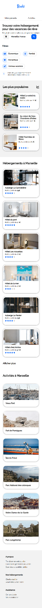
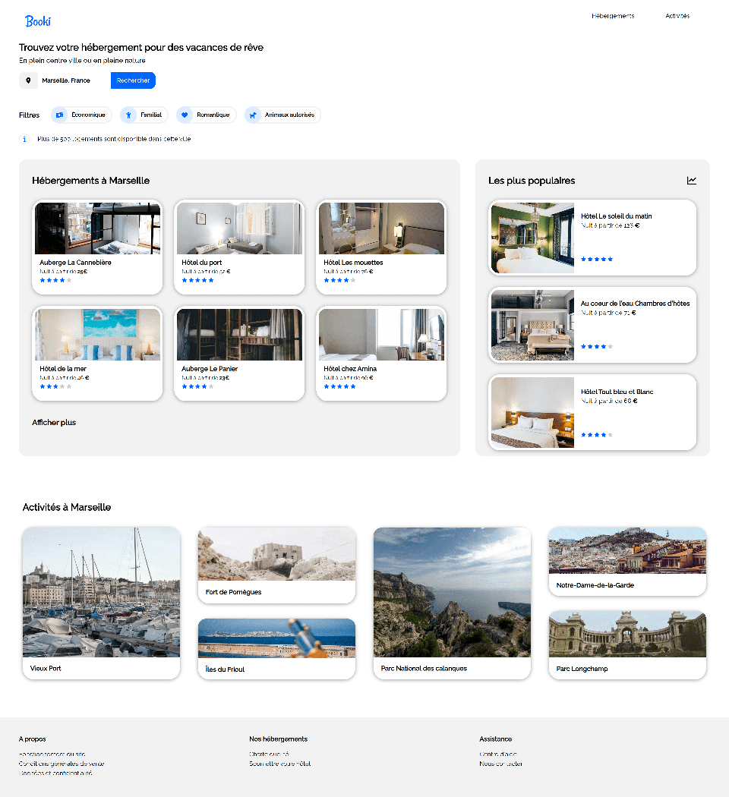

# Booki_html-css

Premier projet réalisé avec OpenClassrooms
https://gaborel_openclassrooms-booki.surge.sh/

## Screens

 

        
Version smartphone

    
 

 

        
Version desktop

    
 

